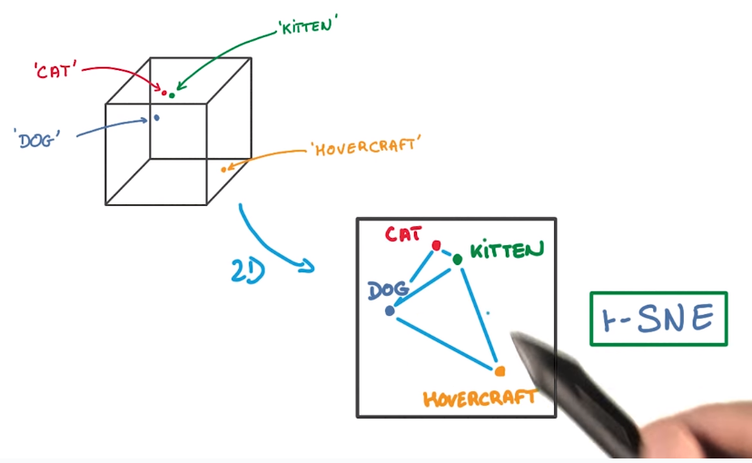

```{r include=FALSE}
library(tidyverse)
library(data.table)
library(tidytext)
library(stringr)
library(tibble)
library(magrittr)
library(rebus)
library(keras)
library(furrr)
plan(multisession)
#-----------
setwd("bbc/")
#-------------
list.dirs() %>% stringr::str_remove_all("\\.") %>% stringr::str_remove_all("/") %>%
  .[ str_length(.) > 0 ] -> categories

data_load <- function(i, ...) {
  list.files(paste0(getwd(),"/", categories[i])) %>%
    enframe() %>%
    mutate(category = categories[i] ) %>%
    mutate(path = paste0(getwd(),"/", categories[i], "/", .$value) ) %>%
    mutate(text = unlist(pmap(. , ~ with(list(...), read_file(path) )  )) ) %>%
    return(.)
}
lapply(1:length(categories), function(i) data_load(i) )  %>% bind_rows() -> DATA
DATA %<>% mutate(text = map_chr(text, unlist ))
set.seed(1)
sample(1:nrow(DATA), nrow(DATA)*0.2) -> test_index
DATA[-test_index, ] -> train_set
DATA[test_index, ] -> test_set
#--------------------------------------------
preprocess <- function(DATA,
                       variable = "main", no_folds = 10) {
  ################
  # HELPER FUNCTIONS
  remove_and_split <- function(DATA, ...) {
    pull_main_corpus  <- function(main) {
      main %>%
        unlist() %>%
        .[-1] %>%
        toString() %>%
        return( . )
    }
    #---------
    num_pattern <- one_or_more(DGT) # regex for numbers
    
    DATA %>%
      mutate(text = map_chr(text, str_remove_all, pattern = num_pattern ) ) %>%
      mutate(header = map(text, str_split, pattern = "\n\n") %>%
               map(~.x[[1]][[1]] )) %>%
      mutate(header = as.character(header) ) %>%
      mutate(main = map(text, str_split, pattern = "\n\n")) %>%
      mutate(main = map_chr(main, pull_main_corpus)) %>%
      return(.)
  }
  collapse_word <- function(data) {
    data %>%
      pull() %>% paste0(collapse = " ") %>%
      return(.)
  }
  unnest_variable <- function(df, variable) {
    df %>%
      #rownames_to_column("id")
      select(-text ,
             -!!sym(ifelse(
               variable == "header",
               "main",
               ifelse(variable == "main", "header", stop("BAD Colname")) )) ) %>%
      unnest_tokens(word,  !!sym(variable), to_lower = T) %>%
      anti_join(get_stopwords(language = "en"), by = "word") %>%
      #nest(-name, -value, -category, -path, -in_train) %>%
      return(.)
  }
  ################
  folds <- caret::createFolds(y = DATA$category , k = no_folds, list = F )
  
  DATA %>%
    remove_and_split() %>%
    rownames_to_column("id") %>%
    select(-name, -value, -path) %>%
    unnest_variable(variable) %>%
    filter(stringr::str_length( word) >= 2)  %>%
    nest(-id, -category) %>%
    mutate(data = map_chr( data, collapse_word) ) %>%
    mutate(fold = folds) %>%
    return(.)
}
onehot_represenation <- function(jolo) {
  jolo %>% as_tibble() %>% select_if(is.factor) -> factor_var
  if (ncol(factor_var) != 0) {
    factor_var %>% onehot::onehot() -> onehot_map
    predict(onehot_map,
            jolo %>% as_tibble() %>% select_if(is.factor) )  -> onehot_data
    
    onehot_data %<>% apply(2, as.integer) %>% as_tibble()
    
    jolo %>% as_tibble() %>% select_if(negate(is.factor)) %>%
      bind_cols(onehot_data) -> jolo
  }
}
tokenize_text <- function(zbior,
                          max_len = 100,
                          max_words = 3e4, is_test = F, use_tf_idf = T,  ...){
  if(is_test == F) {
    if(use_tf_idf == T){
      #--------------------
      zbior %>%
        unnest_tokens(word, data ) %>%
        count(category, word, sort = T) %>%
        bind_tf_idf(word, category, n) %>%
        arrange(desc(tf_idf)) %>%
        distinct(word, .keep_all = T) %>%
        rowid_to_column("value") %>%
        filter(value <= max_words) %>%
        select(value, word) ->> tokenization
      
      to_sequence <- function(sentence,  ...) {
        sentence %>%
          str_split(" ") %>%
          unlist() %>%
          enframe(name = NULL) %>%
          rename(word = value) %>%
          left_join(tokenization, by= "word") %>%
          pull(value) %>%
          return(.)
      }
      
      cat("Tokenizing with inverse term freq index ... \n")
      zbior$data %>%
        future_map( . , to_sequence , .progress = TRUE) -> sekwencja
      
      tokenization %>%
        split(.$word, lex.order = T) %>%
        map(~.$value) ->> word_index
      
      cat("##################\n")
      cat("Found", length(word_index), "unique tokens.\n")
      cat("##################\n")
      
      data <- pad_sequences(sekwencja, maxlen = max_len)
      as_tibble(data) %>%
        mutate(fold = zbior$fold) %>%
        mutate(target = as.factor(zbior$category)) %>% onehot_represenation() -> tibb
    } 
    else if(use_tf_idf == F) {
      ####################
      tokenizer <<- text_tokenizer(num_words = max_words,
                                   filters = "!\"#%&()*+,-./:;<=>?@[\\]^_`{|}~\t\n") %>%
        fit_text_tokenizer(zbior$data)
      #--------------------
      sekwencja <- texts_to_sequences(tokenizer, zbior$data)
      word_index <<- tokenizer$word_index
      cat("##################\n")
      cat("Found", length(word_index), "unique tokens.\n")
      cat("##################\n")
      data <- pad_sequences(sekwencja, maxlen = max_len)
      as_tibble(data) %>%
        mutate(fold = zbior$fold) %>%
        mutate(target = as.factor(zbior$category)) %>% onehot_represenation() -> tibb
    }
  }else if(is_test == T) {
    if(use_tf_idf == T){
      zbior$data %>%
        future_map( . , to_sequence , .progress = TRUE)  -> sekwencja
      data <- pad_sequences(sekwencja, maxlen = max_len)
      as_tibble(data) %>%
        mutate(target = as.factor(zbior$category)) %>% onehot_represenation() -> tibb
      tibb[is.na(tibb)] <- 0
    } 
    else if(use_tf_idf == F){
      sekwencja <- texts_to_sequences(tokenizer = tokenizer, texts = zbior$data)
      data <- pad_sequences(sekwencja, maxlen = max_len)
      as_tibble(data) %>%
        mutate(target = as.factor(zbior$category)) %>% onehot_represenation() -> tibb
    }
  }
  return(tibb)
}
#--------------------------------------------
train_set %>%
  preprocess( variable = "main") %>%
  tokenize_text() -> DATA_tokenized
#--------------------------------------------
setwd("..")
lines <- readLines("glove.6B.100d.txt")
#-----------------------------------
embeddings_index <- new.env(hash = T,
                            parent = emptyenv() )
cat("Loading embedding... \n")
p <- progress_estimated(length(lines))
###############################
options(expressions = 5e5)
for (i in 1:length(lines)) {
  line <- lines[[i]]
  values <- strsplit(line, " ")[[1]]
  word <- values[[1]]
  embeddings_index[[word]] <- as.double(values[-1])
  p$tick()$print()
  #if(i %% 1e5 == 0) {gc()}
}
cat("Found", length(embeddings_index), "word vectors.\n")
#-----------------------------------
max_words = 3e4
emdedding_dim <- 100
max_len <- 100
#---------------------------------
embedding_matrix <- array(0, c(max_words, emdedding_dim))
q <- progress_estimated(length(names(word_index)))
cat("Filling up the embedding matrix...\n")
for (word in names(word_index)) {
  index <- word_index[[word]]
  if (index < max_words) {
    embedding_vector <- embeddings_index[[word]]
    if (!is.null(embedding_vector))
      embedding_matrix[index+1,] <- embedding_vector # not found words will be ALL zero
  }
  q$tick()$print()
}
```

##Task

+ Naszym zadaniem jest klasyfikacja do 5 kategorii, tekstów pochodzących od BBC


```{r}
DATA %>% head(5) %>% select(name, category, text)
```

```{r echo=TRUE}
ggsci::pal_d3() -> paletka
DATA %>%
   select(category) %>%
  ggplot(aes(category, fill = category)) +
  geom_bar(color = "black") +
  ggsci::scale_fill_d3() +
  theme_minimal() +
  ggtitle("Widzimy że target jest zbalansowany")
```


Na wstępie robimy preprocessing:  

  + Usuwam num_pattern (one or more)
  + Usuwam antiwords
  + to_lower_case
  + Usuwam znaki specjalne
  + Zostawiam tylko słowa o długości conajmniej 2 

Funkcja ta oddzielnie traktuje main i header.  

```{r}
DATA %>% 
  preprocess() %>%
  mutate(string_lenth = str_length(data)) %>%
  select(-data) %>%
  arrange(desc(string_lenth)) %>%
  group_by(category) %>%
  mutate(max_length_per_cat = max(string_lenth),
            min_length_per_cat = min(string_lenth),
         mean_length_per_cat = mean(string_lenth)) %>%
  ungroup() %>%
    ggplot(aes(x = category, y = string_lenth, fill = category)) +
    #geom_boxplot(aes(x = category, y = string_lenth)) +
    geom_violin(trim = FALSE) +
    stat_summary( fun.data = "mean_sdl",  fun.args = list(mult = 1))+
    ggsci::scale_fill_d3() +
  ggtitle("Długośc stringów w kategoriach")+
  theme_minimal()
```

```{r}
how_many_words <-  function(uno_line) {
  uno_line %>% str_split(" ") %>% unlist() %>% length() %>%
    return(.)
}

DATA %>% 
  preprocess() %>%
  mutate(word_number = map_int(data , how_many_words )) %>%
  select(-data) %>%
  arrange(desc(word_number)) %>%
  group_by(category) %>%
  # mutate(max_length_per_cat = max(string_lenth),
  #           min_length_per_cat = min(string_lenth),
  #        mean_length_per_cat = mean(string_lenth)) %>%
  ungroup() %>%
    ggplot(aes(x = category, y = word_number, fill = category)) +
    #geom_boxplot(aes(x = category, y = string_lenth)) +
    geom_violin(trim = FALSE) +
    stat_summary( fun.data = "mean_sdl",  fun.args = list(mult = 1))+
    ggsci::scale_fill_d3() +
  ggtitle("Długośc artykułów (w słowach)")+
  theme_minimal()
```

##Embedding

>By nie uczyć od podstaw reprezentaji wektorowej tokenów, będę korzystał z embeddingu **Glove**.

 [**"GloVe: Global Vectors for Word Representation"**](https://nlp.stanford.edu/projects/glove/),  
 Jeffrey Pennington, Richard Socher, and Christopher D. Manning. 2014 

Jako że a priori wydaje się że embedding nauczony reprezentacji na wikipedii będzie najbardziej zbliżony do analizowanych artykułów, zdecydowałem się na:

  + Wikipedia 2014 + Gigaword 5 (6B tokens, 400K vocab, uncased, 50d, 100d, 200d, & 300d vectors, 822 MB download)

Z czego testowałem 50, 100 i 300 wymiarowe embeddingi.  

>By przedstawić w formie wizualnej wektory słów korzystam z techniki redukcji wymiarów **t-SNE**

 [**"Visualizing Data using t-SNE"**](https://lvdmaaten.github.io/publications/papers/JMLR_2008.pdf),  
 Laurens van der Maaten, Geoffrey Hinton, Journal of Machine Learning Research 9 (2008) 2579-2605
 
 Po krótce opiszę jego działanie.  
 
 ### SNE
 
 **PAIRWISE**
 $$HIGH \ DIM \ P(x_j|x_i) = \frac{exp(-||x_i - x_j||^2 / 2\sigma_i^2)}{\sum_{k\neq i} exp(-||x_i - x_k||^2 / 2\sigma_i^2)} \\
 LOW \ DIM \ Q(x_j|x_i) = \frac{exp(-||y_i - y_j||^2 )}{\sum_{k\neq i} exp(-||y_i - y_k||^2 )} \ , \ gdzie \ var = \frac{1}{\sqrt{2}} 
 $$
 Mając $P$ i $Q$ liczymy dywergencję  Kullback-Leibler
 
 $$COST = \sum_i KL(P_i, Q_i) = \sum_i \sum_j P(j|i) \times log(\frac{P(j|i)}{Q(j|i)})$$
 
 >Because the Kullback-Leibler divergence is not symmetric, different types of error in the pairwise distances in the low-dimensional map are not weighted equally. In particular, there is a large cost for using widely separated map points to represent nearby datapoints but there is only a small cost for using nearby map points to represent widely separated datapoints. This small cost comes from wasting some of the probability mass in the relevant Q distributions. In other words, the SNE cost function focuses on retaining the local structure of the data in the map
 
 
 Wariancja $\sigma_i$ rozkładu gaussowskiego o średniej $x_i$ dla **każdego** wielowymiarowego wektora jest związana z hiperparametrem *perplexity*. Wybór $\sigma_i$ indukuje rozkład prawdopodobieństwa $P_i$ dla wszystkich punktów, z entropią układu monotonicznie rosnącą wraz z rosnącym $\sigma_i$.
 
 >SNE performs a binary search for the value of $\sigma_i$ that
produces a $P_i$ with a fixed perplexity that is specified by the user.
 
$$Perp(P_i) = 2^{H(P_i)} = 2^{- \sum_j P(j|i) \times log_2(P(j|i))}$$ 

Autor poleca $Perp \in [5,50]$ 

###t-SNE

t-SNE różni się od SNE wykorzystaniem rozkładu Cauchy zamiast Gaussa.


$$LOW \ DIM \ Q(x_j|x_i) = \frac{exp(-||y_i - y_j||^2 )}{\sum_{k\neq i} exp(-||y_i - y_k||^2 )} \  \rightarrow \
\frac{(1 + ||y_i - y_j||)^{-1}}{\sum_{k\neq i}(1 + ||y_k-y_j||)^{-1}}$$

```{r}

```

Korzystając z 100-d embeddingu glove, tworzę tf-idf, wybieram top 500 per category, jeśli słowo jest w wiecej niż  1 kategorii wybieram jeden rekord o wyższym tf-idf.


```{r include=FALSE}
library(Rtsne)
library(plotly)
library(ggsci)
show_emb <- function(DATA, embeddings_index, variable = "main", top_idf = 500, dims = 3, perplex = 5, ...) {
  if(!top_idf - 1 > 3*perplex) stop("Perplexity too big")
  ggsci::pal_d3() -> paletka
  list() -> lista_emb
  DATA %>%
    preprocess( variable ) %>%
    unnest_tokens(word, data) %>%
    count(category, word, sort = T) %>%
    bind_tf_idf(word, category, n) %>%
    arrange(desc(tf_idf)) -> term_freq_df #%>%
  #group_by(category) %>%
  #top_n(top_idf, tf_idf)
  #-> term_freq_df
  
  select_top_idf <- function(data) {
    data %>%
      top_n(1, tf_idf)
  }
  
  
  term_freq_df %<>%
    nest(-word) %>%
    mutate(prep = map(data, select_top_idf)) %>%
    select(-data) %>%
    unnest() %>%
    group_by(category) %>%
    top_n(top_idf, tf_idf) %>%
    ungroup()
  
  
  find_emb  <- function(term_freq_df, embeddings_index, i,  ...) {
    tibble(word = term_freq_df$word[i]) %>%
      bind_cols(as_tibble(as_tibble(embeddings_index[[term_freq_df$word[i]]]) %>% t())) %>%
      return(.)
  }
  
  map_df(1:nrow(term_freq_df), function(i) find_emb(term_freq_df, embeddings_index, i) ) %>%
    right_join(term_freq_df, by = "word") -> data_after_emb
  data_after_emb %<>% na.omit()
  
  tsne_out <- Rtsne(X = as.matrix(data_after_emb %>% select(starts_with("V"))), dims = dims, perplexity = perplex)
  
  as_tibble(tsne_out$Y) %>%
    bind_cols(data_after_emb %>% select(word, category, tf_idf)) -> tsne_df
  
  tsne_df %>%
    mutate(category = as.factor(category)) %>%
    as_tibble() -> data_to_plot
  
  if(dims == 3){
    data_to_plot %>%
      mutate(tf_idf = 5 * tf_idf) %>%
      plot_ly(. , x = ~ V1, y = ~V2, z = ~V3, color = ~ category, text = ~ word, size = ~  tf_idf,  #alpha = 0.8,
              colors = paletka(unique(tsne_df$category) %>% length()),
              hovertemplate = paste(
                "<b>%{text}</b><br><br>",
                "tf_idf: %{marker.size:, }",
                "<extra></extra>"
              )
      ) %>%
      add_markers() %>%
      layout(title = "t-SNE on embedding") -> plocik
  } else if(dims == 2){
    data_to_plot %>%
      mutate(tf_idf = 5 * tf_idf) %>%
      plot_ly(. , x = ~ V1, y = ~V2,  color = ~ category, text = ~ word, size = ~  tf_idf,  #alpha = 0.8,
              colors = paletka(unique(tsne_df$category) %>% length()),
              hovertemplate = paste(
                "<b>%{text}</b><br><br>",
                "tf_idf: %{marker.size:, }",
                "<extra></extra>"
              )
      ) %>%
      add_markers() %>%
      layout(title = "t-SNE on embedding") -> plocik
  }
  plocik %>%
    return(.)
  
}
```


```{r}
show_emb(train_set, embeddings_index, dims = 3, perplex = 7) -> tsne_3dim
tsne_3dim
```
```{r}
show_emb(train_set, embeddings_index, dims = 2, perplex = 7) -> tsne_2dim
tsne_2dim
```

